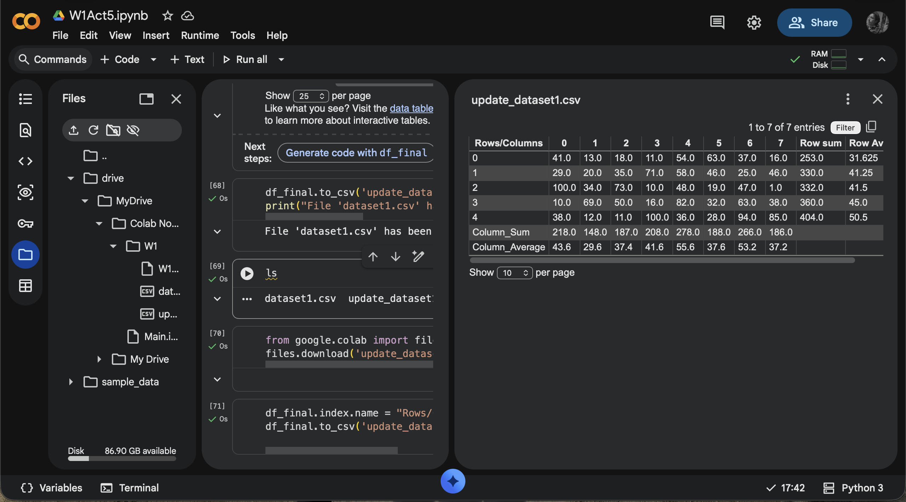

# Computing Data using GCP

The program loads a small CSV data using Google Colab. It Calculates sums and average for both Columns and rows, after that concatenates the results to the data

## Features

- Load CSV data int a Pandas DataFrame.
- Displays dataset and shows its size.
- Sum and Average calculation for each Column and Row.
- Index the results as new columns and rows.
- Export updated data as CSV.

### Screenshot

## Environment

- Python 3.x
- Pandas
- Google Colab (GCP)